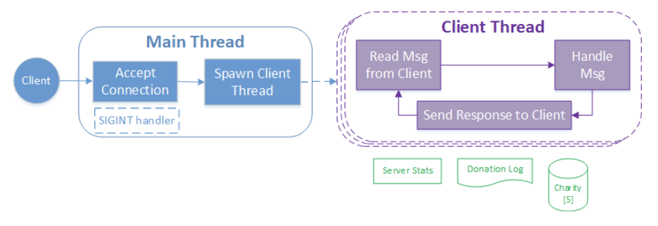
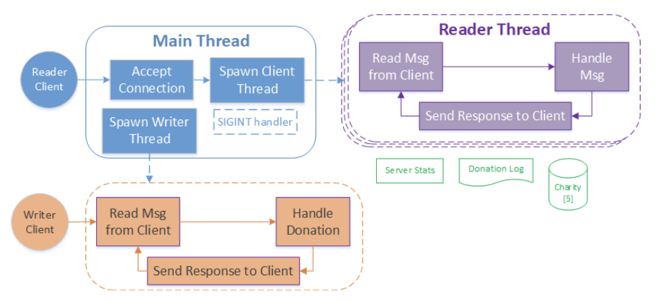

# zotdonate: a small-scale charity-donation server 
Two versions: 
1) A multi-threaded, charity/donation server. The first version handles each of the client (donor) with a thread. All threads interact with the shared data structures. 
2) The second version utilizes a readers-writer model (reader preference).

- Note: corresponding client programs are pre-provided binaries (in ./bin/) rather than programmed ones. 

# Testing everything for thread-safe code (preferably run test.sh in multiple terminal panes/sessions at once):
```
./test.sh
```

# Part 1 - Multi-threaded Server





```
./bin/ZotDonate_MTserver [-h] PORT_NUMBER LOG_FILENAME

-h                 Displays this help menu and returns EXIT_SUCCESS
PORT_NUMBER        Port number to listen on
LOG_FILENAME       File to output server actions into. Create/overwrite, if exists
```

Example:
```
$ ./bin/ZotDonate_MTserver 3200 4000 log. txt 2> err. txt
Listening for readers on port 3200.
Listening for writers on port 4000.
```


# Part 2 - Readers-Writer Server





```
./bin/ZotDonate_RWserver [-h] R_PORT_NUMBER W_PORT_NUMBER LOG_FILENAME

-h                 Displays this help menu and returns EXIT_SUCCESS
R_PORT_NUMBER      Port number to listen on for reader (observer) clients
W_PORT_NUMBER      Port number to listen on for writer (donor) clients
LOG_FILENAME       File to output server actions into. Create/overwrite, if exists
```


<table>
  <tr>
   <td><strong><code>msgtype</code></strong>
   </td>
   <td><strong>Name</strong>
   </td>
   <td><strong>Description</strong>
   </td>
   <td><strong>Sent By</strong>
   </td>
  </tr>
  <tr>
   <td><code>0x00</code>
   </td>
   <td><code>DONATE</code>
   </td>
   <td>Donate the specified amount to the specified charity based on <code>msgdata donation</code> information. Updates to all fields of the charity on the server are performed based on the donation. Add the donation amount to a local total for the client (for maxDonations).
   </td>
   <td>Client
   </td>
  </tr>
  <tr>
   <td>
   </td>
   <td>
   </td>
   <td>Upon success, the client thread replies with the same message received.
<p>
Once the response is set to the client, print <code>"&lt;fd> DONATE &lt;charity> &lt;amount>\n"</code> to the donation log. 
   </td>
   <td>Server
   </td>
  </tr>
  <tr>
   <td><code>0x01</code>
   </td>
   <td><code>CINFO</code>
   </td>
   <td>Request for info about the charity specified in the  <code>msgdata donation charity</code> field, other fields are ignored  
   </td>
   <td>Client
   </td>
  </tr>
  <tr>
   <td>
   </td>
   <td>
   </td>
   <td>Client thread replies with info in <code>msgdata charityInfo</code>
<p>
Once the response is set to the client, print <code>"&lt;fd> CINFO &lt;charity>\n"</code> to the donation log. 
   </td>
   <td>Server
   </td>
  </tr>
  <tr>
   <td rowspan="2" ><code>0x02</code>
   </td>
   <td rowspan="2" ><code>TOP</code>
   </td>
   <td>Request for 3 largest total donations made by any client. <code>msgdata</code> is ignored.
   </td>
   <td>Client
   </td>
  </tr>
  <tr>
   <td>Client thread replies with data in <code>msgdata maxDonations</code> fields
<p>
Once the response is set to the client, print <code>"&lt;fd> TOP\n"</code> to the donation log. 
   </td>
   <td>Server
   </td>
  </tr>
  <tr>
   <td><code>0x03</code>
   </td>
   <td><code>LOGOUT</code>
   </td>
   <td>Upon receipt, the server terminates the client's socket connection. Print <code>"&lt;fd> LOGOUT\n"</code> to the donation log.  \
If necessary, update to top 3 <code>maxDonations</code>. 
   </td>
   <td>Client
   </td>
  </tr>
  <tr>
   <td rowspan="2" ><code>0x04</code>
   </td>
   <td rowspan="2" ><code>STATS</code>
   </td>
   <td>Request for information about the charity with the largest and the smallest donation totals. <code>msgdata</code> is ignored.
   </td>
   <td>Client
   </td>
  </tr>
  <tr>
   <td>Thread replies with data in <code>msgdata stats</code> fields
<p>
Once the response is set to the client, print <code>"&lt;fd> STATS &lt;charity_high>:&lt;amount_high> &lt;charity_low>:&lt;amount_low>\n"</code> to the donation log. 
   </td>
   <td>Server
   </td>
  </tr>
  <tr>
   <td><code>0xFF</code>
   </td>
   <td><code>ERROR</code>
   </td>
   <td>Error occurred due to an invalid message
<p>
Once the response is set to the client, print <code>"&lt;fd> ERROR\n"</code> to the donation log. 
   </td>
   <td>Server
   </td>
  </tr>
</table>


# Part 1 - Multi-threaded Server - Client


```
./bin/ZotDonate_client [-h] SERVER_ADDR SERVER_PORT

-h                 Displays this help menu and returns EXIT_SUCCESS
SERVER_ADDR        The IP address of the server to connect to
SERVER_PORT        The port to connect to
```


# Part 2 - Readers-Writer Server  - Client


```
./bin/ZotDonate_Wclient [-h] SERVER_ADDR SERVER_PORT
-h                 Displays this help menu and returns EXIT_SUCCESS
SERVER_ADDR        The IP address of the server to connect to
SERVER_PORT        The port to connect to
```


```
./bin/ZotDonate_Rclient [-h] SERVER_ADDR SERVER_PORT
-h                 Displays this help menu and returns EXIT_SUCCESS
SERVER_ADDR        The IP address of the server to connect to
SERVER_PORT        The port to connect to
```


# Full list of Client Commands


<table>
  <tr>
   <td><strong>Command(s)</strong>
   </td>
   <td><strong>Description</strong>
   </td>
   <td><strong>Client Version</strong>
   </td>
  </tr>
  <tr>
   <td><code>/help</code>
<p>
<code>/h</code>
   </td>
   <td>Lists available commands to run
   </td>
   <td><code>All</code>
   </td>
  </tr>
  <tr>
   <td><code>/donate charity_id amount</code>
<p>
<code>/d charity_id amount</code>
   </td>
   <td>Sends a request to the server to donate to the specified charity for the specified amount. Both <code>charity_id</code> and <code>amount</code> must be integer values.
<p>
msgtype: <code>DONATE</code>
   </td>
   <td><code>client \
Wclient</code>
   </td>
  </tr>
  <tr>
   <td><code>/cinfo charity_id</code>
<p>
<code>/c</code>
   </td>
   <td>Sends a request to the server for all information about a specific charity. Results are displayed on the terminal.
<p>
msgtype: <code>CINFO</code>
   </td>
   <td><code>client</code>
<p>
<code>Rclient</code>
   </td>
  </tr>
  <tr>
   <td><code>/top</code>
<p>
<code>/t </code>
   </td>
   <td>Sends a request to the server for the top 3 total client donations. Results are displayed on the terminal. \
msgtype: <code>TOP</code>
   </td>
   <td><code>client</code>
<p>
<code>Rclient</code>
   </td>
  </tr>
  <tr>
   <td><code>/stats</code>
<p>
<code>/s</code>
   </td>
   <td>Sends a request to the server for the charity with the highest and lowest donation amounts. Results are displayed on the terminal.
<p>
msgtype: STATS
   </td>
   <td><code>Rclient</code>
   </td>
  </tr>
  <tr>
   <td><code>/logout</code>
<p>
<code>/quit</code>
<p>
<code>/q</code>
   </td>
   <td>Sends a request to the server to logout the user. 
<p>
msgtype: <code>LOGOUT</code>
   </td>
   <td><code>All</code>
   </td>
  </tr>
</table>

